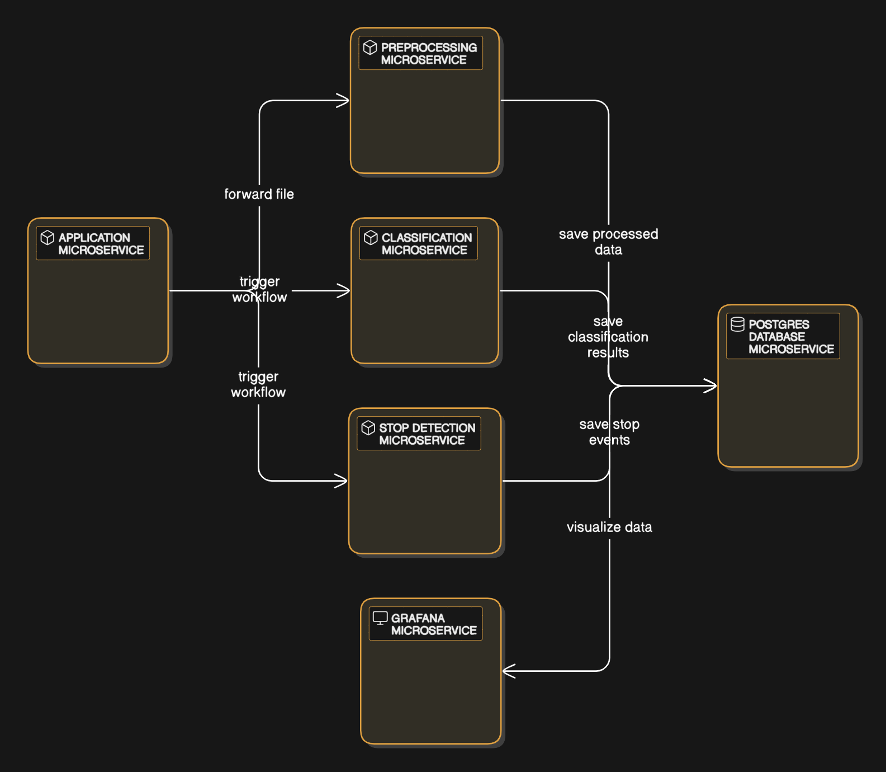

### Architecture Overview
The application consists of **6 containers**, each with specific roles to ensure seamless functionality:

1. **Application Container**
    - **Role**: Acts as the entry point for user requests.
    - **Functionality**: 
        - Receives files from users via HTTP requests.
        - Forwards the received file to the **Preprocessing Container** for processing.
        - Simultaneously sends requests to the **Classification Container** and the **Stop Detection Container** to trigger their respective workflows.
2. **Preprocessing Container**
    - **Role**: Handles initial data processing tasks.
    - **Functionality**: 
        - Performs preprocessing operations, such as **data imputation** and **peak detection**.
        - Saves the processed data into the **Postgres Database Container**.
3. **Classification Container**
    - **Role**: Executes classification tasks.
    - **Functionality**: 
        - Analyzes the data for classification purposes.
        - Stores the classification results in the **Postgres Database Container**.
4. **Stop Detection Container**
    - **Role**: Identifies stop events within the data.
    - **Functionality**: 
        - Executes stop detection algorithms.
        - Saves the detected stop events into the **Postgres Database Container**.
5. **Postgres Database Container**
    - **Role**: Centralized storage for all application results.
    - **Functionality**: 
        - Stores data processed by the Preprocessing Container.
        - Stores results from the Classification and Stop Detection Containers.
        - Acts as the data source for the **Grafana Container**.
6. **Grafana Container**
    - **Role**: Provides a user-friendly dashboard for data visualization.
    - **Functionality**: 
        - Connects to the **Postgres Database Container** as its data source.
        - Visualizes processed data, classification results, and stop detection results in an interactive dashboard.
---

### Workflow Summary
1. The **Application Container** receives a file via an HTTP request.
2. The file is sent to the **Preprocessing Container** for initial processing.
3. Requests are sent to both the **Classification Container** and **Stop Detection Container** to trigger their respective computations.
4. The **Preprocessing Container**, **Classification Container**, and **Stop Detection Container** save their results in the **Postgres Database Container**.
5. The **Grafana Container** visualizes the aggregated data from the database for end-users.

 